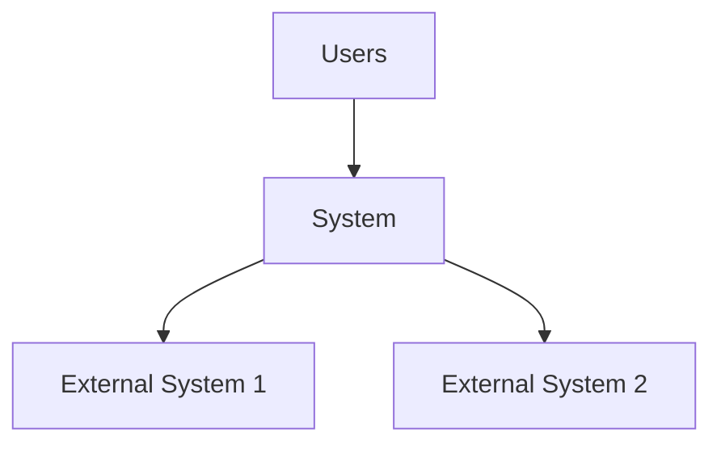
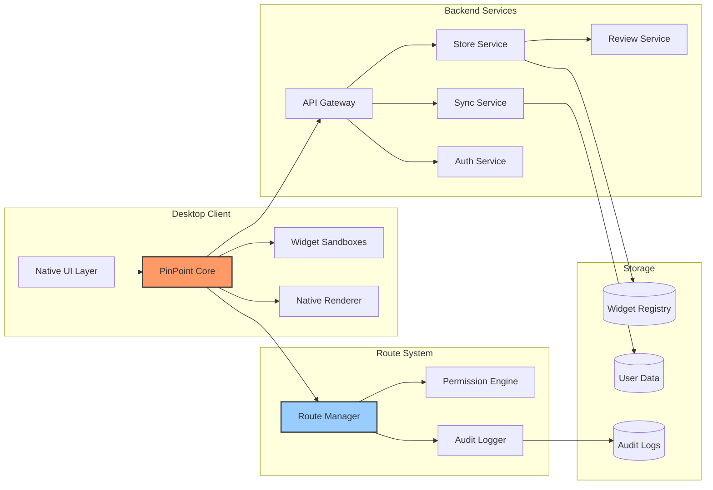
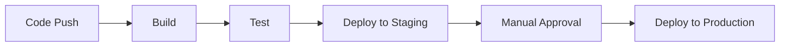

1. Executive Summary
# Software Architecture Plan

## 1. Executive Summary

### 1.1 Project Overview
PinPoint is a desktop application that serves as a widget ecosystem, allowing users to pin customizable widgets to their desktop. It provides a standardized framework ensuring consistent UI/UX, security, and performance across all widgets while offering developers a familiar and flexible development environment.
### 1.2 Key Architectural Decisions
### Decision 1: Native-First Rendering Architecture
**What we chose:** Native rendering engine with web-based widget logic

**How it works:**
- Widgets are written in JavaScript/HTML (easy for developers)
- But they render using native graphics (Metal on Mac, DirectX on Windows)
- Like how games achieve smooth 60-120 FPS

**Why this gives iPhone-like smoothness:**
- Animations run on the GPU (graphics card)
- No web browser overhead for visuals
- Same technology iOS uses for smooth scrolling

---

### Decision 2: Smart Performance Management
**What we chose:** Automatic quality adjustment based on system resources

**How it works:**
- PinPoint monitors system performance
- Adjusts widget quality automatically
- Prioritizes smoothness over features when needed

**Example:**
```
High-end PC: 
  → Full animations at 120 FPS
  → Real-time updates
  → Advanced visual effects

Older laptop:
  → Smooth 60 FPS maintained
  → Simpler animations
  → Updates optimized
```

---

### Decision 3: Shared Resource System
**What we chose:** All widgets share core resources instead of duplicating them

**Think of it like:**
- An apartment building where everyone shares electricity/water (efficient)
- vs. Every apartment having its own power plant (wasteful)

**Benefits:**
- 10x less memory usage
- Faster widget startup
- More widgets can run simultaneously

---

### Decision 4: Progressive Permission System
**What we chose:** Permissions are checked once at startup, not constantly

**How it works:**
- When widget starts: Full security check
- During operation: Ultra-fast cached permissions
- Result: Security without slowdown

**Like iPhone apps:**
- Ask for camera permission once
- Then camera works instantly every time

---

### Decision 5: Route-Based Data Flow and System Permission Routes
**What we chose:** Pre-defined data and system paths that users can understand

**The routes:**
- Data Routes: Control where data can flow (servers (which level of encryption), storage)
- System Routes: Control what system resources widgets can access

**Why this matters:**
- Developers know the rules upfront
- No confusion or hidden behaviors
- Complete transparency: Users see both "where data goes" AND "what system access"
- Better security: Can't access clipboard without declaring it
- Clearer permissions: "This widget needs camera access" is obvious
---
### 1.3 Major Components

### 1. PinPoint Engine (The Brain)
**What it does:** Manages everything, like iOS manages iPhone apps

**Key features:**
- Starts/stops widgets instantly
- Manages memory like a phone (suspends unused widgets)
- Handles all the complex stuff so widgets stay simple

---

### 2. Native Render Engine (The Artist)
**What it does:** Makes everything look beautiful and smooth

**How it works:**
- Uses same technology as video games
- 60-120 frames per second
- Butter-smooth animations
- Hardware accelerated (uses graphics card)

**User experience:**
- Dragging widgets feels instant
- Animations are fluid like iPhone
- No stuttering or lag

---

### 3. Widget Sandbox (The Security Guard)
**What it does:** Keeps each widget in its own safe space

**Like iPhone apps:**
- Each widget is isolated
- Can't access other widgets' data
- Can't harm your system
- But still runs fast

---

### 4. Permission Manager (The Gatekeeper)
**What it does:** Controls what widgets can access

**Smart features:**
- Visual permission dashboard
- One-click privacy modes
- See exactly what each widget accesses
- Change permissions anytime

**Example display:**
```
Weather Widget wants to:
✅ Location (for local weather)
✅ Internet (to fetch forecasts)
❌ Contacts (not needed - blocked)
❌ Files (not needed - blocked)

[Allow] [Customize] [Deny]
```

---

### 5. Widget Store (The Marketplace)
**What it does:** Safe place to discover and install widgets

**Features:**
- One-click install
- Automatic updates
- User reviews
- Security scanning
- Developer showcase

---

### 6. Developer Kit (The Toolbox)
**What it does:** Makes it easy to build great widgets

**Includes:**
- Simple widget templates
- Visual design tools
- Performance profiler
- One-click publishing

**Developer experience:**
```javascript
// Building a widget is this simple:
class MyWidget extends PinPoint.Widget {
  render() {
    return <Clock style="elegant" />
  }
}
```

---

### 7. Performance Monitor (The Optimizer)
**What it does:** Keeps everything running smoothly

**How it helps:**
- Automatically suspends inactive widgets
- Prevents any widget from slowing system
- Optimizes battery usage on laptops
- Shows performance stats to users

---

## The Result: iPhone-Smooth Desktop Widgets

### What users experience:
1. **Instant Response** - Click and drag with zero delay
2. **Smooth Animations** - 60-120 FPS like iPhone
3. **Beautiful Visuals** - Native rendering quality
4. **Always Responsive** - System never slows down
5. **Clear Privacy** - See and control all data flow

### What developers get:
1. **Easy Development** - Use familiar web technologies
2. **Automatic Optimization** - Platform handles performance
3. **Rich Animations** - Access to native effects
4. **Happy Users** - Smooth experience = good reviews

### What makes PinPoint special:
- **Performance of native apps** (like iPhone widgets)
- **Security of web apps** (sandboxed and safe)
- **Transparency of open source** (clear data flows)
- **Business model of app stores** (sustainable ecosystem)
---

## 2. Architecture Vision & Goals

### 2.1 Business Goals
- **Strategic Objectives**
  - "Create a 'closed city' platform where widgets operate on pre-defined, transparent routes"
  - "Make data flow as clear as street signs - users always know where their data travels"
- **Success Metrics**
  - User Adoption: 100K users in Year 1, 1M+ by Year 2
  - Developer Ecosystem: 1,000 widgets available by Month 6, 10,000 by Year 2
  - Revenue Targets: $1M ARR by Year 1 (subscriptions + developer revenue share)
  - Platform Health: 4.5+ star average rating, <0.1% security incidents, 99.9% uptime
  - Engagement: Average 5 widgets per user, 80% daily active users
- **Constraints**
  - Initial team of 5-10 developers
  - Must work on Windows/Mac from day 1, Linux can wait
  - Cannot compromise on security/privacy for features
- **Assumptions**
  - Users want desktop widgets but current solutions are inadequate
  - Developers will build widgets if monetization exists
  - Privacy-conscious market is large enough to sustain business
  - Native performance is critical for user adoption

### 2.2 Technical Goals
- **Performance Targets**
  - Widget Startup: <50ms from click to interactive
  - Frame Rate: Consistent 60 FPS minimum, 120 FPS capable
  - Memory Usage: <20MB per widget baseline, <200MB for 10 widgets
  - CPU Usage: <0.1% per idle widget, <5% total when inactive
  - Battery Impact: No more than 10% reduction in battery life
  - Launch Time: PinPoint app cold start <2 seconds

- **Scalability Requirements**
  - Concurrent Widgets: Support 50+ widgets on high-end systems, 10+ on basic systems
  - Widget Store: Handle 1M+ daily active users browsing/downloading
  - Developer Platform: Support 100K+ widget submissions and updates
  - Multi-Monitor: Seamless support for 4+ displays
  - Widget Complexity: From simple clocks to complex real-time visualizations
  - Update System: Push updates to 1M+ widgets within 24 hours
  
- **Security Objectives**
  - Zero Day Protection: Sandbox escape impossible by design
  - Privacy Guarantee: User data routing transparent and controlled
  - Malware Prevention: 99.99% malicious widgets caught before distribution
  - Audit Trail: Complete logging of all system access and data flows
  - Secure Distribution: Code signing and integrity verification for all widgets
  - Rapid Response: Ability to remotely disable malicious widgets within minutes

- **Maintainability Goals**
  - Code Quality: 80%+ test coverage, automated CI/CD pipeline
  - Widget SDK Stability: Breaking changes max once per year
  - Platform Updates: Security patches within 48 hours, features monthly
  - Developer Experience: Widget creation to store submission in <1 hour
  - Documentation: 100% API coverage, tutorials for top 20 use cases
  - Monitoring: Real-time platform health, widget crash reporting, performance metrics
---
- **Vision Statement**

"PinPoint transforms the desktop into a living, productive workspace where beautiful, secure widgets provide information and functionality at a glance. Like iPhone brought apps to mobile, PinPoint brings the infrastructure for the enabling of intelligent widgets to desktop - with with uncompromising performance, security, and user control over their data."
## 3. Requirements Analysis

### 3.1 Functional Requirements

#### Core Features
- Widget Marketplace - A secure store where users discover and install widgets (like city's main gate)
- Route Declaration System - Every widget must declare which data and system-level routes it uses (city registration)
  Data Routes: 🟢 Local, 🟡 Encrypted, 🟠 AI-Enhanced, 🔴 Full
  System Routes: 🟢 Citizen, 🟡 Observer, 🟠 Interactive, 🔴 Privileged
- Visual Permission Dashboard - Users see and control each widget's routes and permissions
- Widget Sandbox Engine - Isolated execution environment for each widget (like separate houses)
- Native Rendering System - Smooth 60-120 FPS animations using GPU acceleration
- Multi-Monitor Support - Widgets can be placed on any screen in multi-display setups
- Developer SDK & Tools - Complete toolkit for creating, testing, and publishing widgets
- Live Widget Updates - Widgets update in real-time without freezing or stuttering
- Secure Payment System - For premium widgets and developer payouts
- Widget Backup & Sync - Save widget layouts and settings across devices
#### User Stories
```
For End Users:
As a productivity-focused user
I want to see my calendar, todos, and emails at a glance
So that I can stay organized without switching between apps

As a privacy-conscious user  
I want to see exactly where my data goes or how deep the widget tweak my system (which route)
So that I can trust the widgets I'm using

As a stock trader
I want real-time stock prices on my desktop with programable notification
So that I can monitor markets while working

As a general user
I want the routes and system-level to be good and easy to understand 
defined, so I'm not confused between choices

For Developers:
As a widget developer
I want clear documentation and simple APIs
So that I can build widgets quickly

As a developer
I want to monetize my widgets
So that I can sustain development

As a developer
I want to choose between privacy routes
So that I can offer both simple and feature-rich versions

As a developer
I want the routes and system-level to be good and easy to understand 
defined, so I know user of my app does not get confused and does not use
this platform

For IT Administrators:
As an IT admin
I want to control which widgets employees can install
So that I can maintain security compliance

As an IT admin
I want to see audit logs of widget data access
So that I can ensure no data leaks occur

```

#### Business Rules
- Widget Review Required - All widgets must pass automated and manual review before store listing 
- Route Declaration Mandatory - Widgets cannot access any data/systems outside their declared routes
- Revenue Share 90/10 - Developers keep 90% of widget sales/subscriptions
- One-Strike Malware Policy - Any developer publishing malware is permanently banned
- Privacy Label Accuracy - Misrepresenting data routes results in immediate widget removal
- Performance Standards - Widgets using >25% CPU or >100MB RAM fail review
- Update Review Fast-Track - Security updates reviewed within 24 hours
- User Data Portability - Users can export all their widget data at any time
- Refund Window - 24-hour refund period for paid widgets
- Open Source Option - Developers can optionally open-source widgets for trust

### 3.2 Non-Functional Requirements

| Category | Requirement | Target |
| :--- | :--- | :--- |
| **Performance** | Widget Startup Time | < 50ms |
| **Performance** | Frame Rate | 60 FPS minimum, 120 FPS capable |
| **Performance** | Memory per Widget | < 20MB baseline |
| **Performance** | CPU Usage (Idle) | < 0.1% per widget |
| **Security** | Sandbox Escape | Zero tolerance - impossible by design |
| **Security** | Code Signing | All widgets cryptographically signed |
| **Security** | Permission Model | Capability-based with user consent |
| **Security** | Data Encryption | AES-256 for "Encrypted Highway" route |
| **Reliability** | Platform Uptime | 99.9% (< 9 hours downtime/year) |
| **Reliability** | Widget Crash Isolation | One widget crash doesn't affect others |
| **Reliability** | Data Durability | 99.999% for synced widget data |
| **Usability** | Install Time | < 5 seconds from click to running |
| **Usability** | Learning Curve | Grandparent-friendly interface |
| **Usability** | Accessibility | WCAG 2.1 AA compliance |
| **Scalability** | Concurrent Widgets | 50+ on high-end, 10+ on basic systems |
| **Scalability** | Store Capacity | 1M+ widgets, 100M+ users |
| **Scalability** | Update Distribution | 1M widgets updated in < 24 hours |
| **Compliance** | Data Protection | GDPR, CCPA compliant |

### 3.3 Constraints
- **Technical Constraints**
  - Cross-Platform from Day 1 - Must support Windows 10/11 and macOS 12+ immediately
  - No Admin Rights Required - PinPoint must install and run without administrator privileges
  - Existing Tech Stack - Must use JavaScript/TypeScript for widgets (developer familiarity)
  - GPU Requirement - Requires DirectX 11/Metal support for native rendering
  - Internet Optional - Core features must work offline (except store and sync)
  - No Browser Engine - Cannot use Chromium/WebKit (too heavy for widgets)
- **Business Constraints**
  - Developer Acquisition - Need 100+ widgets at launch (chicken-egg problem)
  - No Ads in Core - Revenue from subscriptions/sales only, no advertising
  - Privacy Reputation - Cannot have any privacy scandals in first 2 years
  - Patent Landscape - Must avoid existing widget/dashboard patents
  
- **Critcal Success Requirements**
Must Have (MVP):
  - Route-based security system working
  - 10+ high-quality widgets at launch
  - Smooth 60 FPS performance
  - One-click install process
  - Basic widget store
Should Have (6 months):

- Developer monetization
- Widget sync across devices
- 100+ widgets available
- Enterprise features

Nice to Have (Year 1):

- Linux support
- Mobile companion app
- AI-powered features
- Widget analytics dashboard
---

## 4. High-Level Architecture

### 4.1 Architecture Style
- **Pattern**: Hybrid Client-Service Architecture with Plugin System
Core: Monolithic desktop application (for performance)
Widgets: Plugin-based architecture (for isolation)
Backend: Microservices (for scalability)
- **Justification**: 
Monolithic Core: Native performance requires tight integration with OS. Shared resources (renderer, compositor) work best in single process
Plugin Widgets: Each widget runs in isolated sandbox - security through separation while maintaining performance through shared runtime
Microservices Backend: Widget store, user accounts, and sync services scale independently. Can add AI services, analytics without affecting core
Why not pure microservices: Desktop performance requires native integration. Network latency would kill the "iPhone smooth" experience
Why not pure monolithic: Widgets need isolation for security. Mixed architecture gives best of both worlds

### 4.2 System Context



### 4.3 Component Overview



#### Component Responsibilities

| Component | Responsibility |
|-----------|----------------|
| PinPoint Core | Main application runtime - manages widget lifecycle, resource allocation, and coordinates all subsystems. The "brain" of the desktop app |
| Widget Sandboxes | Isolated V8 contexts where widget JavaScript runs. Each widget gets its own sandbox with enforced memory/CPU limits |
| Native Renderer | GPU-accelerated rendering engine using Metal/DirectX. Composites all widgets at 60-120 FPS for smooth performance |
| Route Manager | Enforces the "city routes" - ensures widgets only access declared data paths. Blocks unauthorized network/system access |
| Permission Engine | Manages user consent for widget capabilities. Caches permissions for performance, enforces at runtime |
| Audit Logger | Records all widget data access and system interactions. Provides transparency and debugging capabilities |
| Native UI Layer | Platform-specific UI (Win32/Cocoa) for system integration, tray icon, and widget chrome |
| API Gateway | Single entry point for all backend services. Handles authentication, rate limiting, and request routing |
| Store Service | Widget marketplace backend - handles browsing, search, downloads, reviews, and developer uploads |
| Sync Service | Encrypted synchronization of widget data and layouts across user's devices |
| Auth Service | User authentication and account management. Supports social login and 2FA |
| Review Service | Automated and manual widget review pipeline. Scans for malware, validates routes, tests performance |
| Widget Registry DB | Store all widget metadata, versions, developer info, and review status |
| User Data DB | Encrypted storage for user preferences, widget configurations, and sync data |
| Audit Logs DB | Tamper-proof storage of all system access logs for compliance and security analysis |
---
### 4.4 Data Flow for Key Scenarios
- Installing a Widget:
sequenceDiagram
    User->>UI: Browse Store
    UI->>Core: Request Widget List
    Core->>Gateway: GET /widgets
    Gateway->>Store: Fetch Popular
    Store-->>Gateway: Widget List
    Gateway-->>Core: Widget Data
    Core-->>UI: Display Widgets
    
    User->>UI: Install Widget
    UI->>Core: Download Widget
    Core->>RouteManager: Validate Routes
    RouteManager->>PermissionEngine: Check Permissions
    PermissionEngine-->>UI: Show Permission Dialog
    User->>UI: Approve
    
    Core->>Gateway: Download Widget Package
    Gateway->>CDN: Fetch Package
    CDN-->>Core: Widget Code
    Core->>Sandbox: Create New Sandbox
    Sandbox->>Renderer: Register Widget
    Renderer-->>UI: Widget Displayed

- Widget Accessing Data (Route Enforcement):
sequenceDiagram
    Widget->>Sandbox: fetch("weather.com/api")
    Sandbox->>RouteManager: Check Route Permission
    RouteManager->>RouteManager: Validate Against Declared Routes
    alt Route Allowed
        RouteManager->>AuditLogger: Log Access
        RouteManager-->>Sandbox: Permission Granted
        Sandbox->>Network: Make Request
        Network-->>Widget: Weather Data
    else Route Blocked
        RouteManager->>AuditLogger: Log Violation
        RouteManager-->>Sandbox: Permission Denied
        Sandbox-->>Widget: Error: Unauthorized Route
    end

### 4.5 Deployment View
graph TB
    subgraph "User's Computer"
        PinPointApp[PinPoint.app/exe]
        LocalStorage[(Local Widget Data)]
        GPU[GPU - Native Rendering]
    end
    
    subgraph "PinPoint Cloud - AWS/Azure"
        subgraph "Frontend"
            CloudFront[CDN - Widget Downloads]
            ALB[Load Balancer]
        end
        
        subgraph "Application Layer"
            API1[API Server 1]
            API2[API Server 2]
            Review1[Review Worker]
        end
        
        subgraph "Data Layer"
            RDS[(PostgreSQL - Metadata)]
            S3[(S3 - Widget Packages)]
            DynamoDB[(DynamoDB - User Prefs)]
        end
    end
    
    subgraph "Developer Infrastructure"
        DevAPI[Developer APIs]
        DevPortal[Dev Portal Web]
    end
    
    PinPointApp --> CloudFront
    PinPointApp --> ALB
    ALB --> API1
    ALB --> API2
    
    API1 --> RDS
    API1 --> S3
    API1 --> DynamoDB
    
    DevAPI --> Review1
    Review1 --> S3
    
## 5. Detailed Design

### 5.1 Component Architecture

#### Component: 
- PinPoint Core Component:
**Purpose**: The central orchestrator that manages everything - like the city's control center.
**Internal structure**:
PinPoint Core:
  ├── Widget Lifecycle Manager
  │   ├── Widget Loader (installs/starts widgets)
  │   ├── State Manager (saves/restores widget positions)
  │   ├── Resource Monitor (tracks CPU/memory usage)
  │   └── Crash Handler (isolates widget failures)
  │
  ├── Event System
  │   ├── User Input Router (mouse/keyboard to widgets)
  │   ├── System Event Handler (sleep/wake, display changes)
  │   └── Widget Communication Bus (if allowed between widgets)
  │
  ├── Platform Integration
  │   ├── OS API Bridge (Windows/macOS specific features)
  │   ├── System Tray Manager
  │   └── Notification Service
  │
  └── Core Services
      ├── Update Manager (handles PinPoint and widget updates)
      ├── Telemetry Service (anonymous usage stats)
      └── Crash Reporter
**Interfaces/APIs**:
// Widget Management API
interface WidgetManager {
  installWidget(widgetId: string): Promise<Widget>
  uninstallWidget(widgetId: string): Promise<void>
  startWidget(widgetId: string): Promise<void>
  stopWidget(widgetId: string): Promise<void>
  getRunningWidgets(): Widget[]
  setWidgetPosition(widgetId: string, x: number, y: number): void
}

// Resource Management API
interface ResourceManager {
  getWidgetResources(widgetId: string): ResourceUsage
  setResourceLimit(widgetId: string, limits: ResourceLimits): void
  suspendWidget(widgetId: string): void
  resumeWidget(widgetId: string): void
}
**Dependencies**:
Native OS APIs (Win32/Cocoa)
Widget Sandbox Engine
Native Renderer
Route Manager
#### Widget Sandbox Component: 
**Purpose**: Secure isolation environment for each widget - like each house in our city
**Internal Structure**:
Widget Sandbox:
  ├── V8 Isolate Instance
  │   ├── JavaScript Context
  │   ├── Memory Heap (isolated)
  │   └── Execution Thread
  │
  ├── Security Boundary
  │   ├── API Filter (only allowed APIs exposed)
  │   ├── Network Interceptor
  │   ├── File System Jail
  │   └── IPC Channel (to Core)
  │
  ├── Resource Controls
  │   ├── CPU Throttler
  │   ├── Memory Limiter
  │   ├── Network Rate Limiter
  │   └── Disk I/O Controller
  │
  └── Widget Runtime
      ├── PinPoint Widget API
      ├── DOM Emulation (lightweight)
      ├── Event Handlers
      └── Lifecycle Hooks

**Interfaces/API**:
// Exposed to Widgets (inside sandbox)
interface PinPointWidgetAPI {
  // Storage
  storage: {
    local: {
      get(key: string): Promise<any>
      set(key: string, value: any): Promise<void>
    }
    sync?: { // Only if sync route declared
      get(key: string): Promise<any>
      set(key: string, value: any): Promise<void>
    }
  }
  
  // Network (filtered by routes)
  fetch(url: string, options?: RequestInit): Promise<Response>
  
  // UI
  render(element: VirtualElement): void
  on(event: string, handler: Function): void
  
  // System (limited access)
  system: {
    getTime(): Date
    getCPUUsage?(): number // Only if permission granted
  }
}

#### Route Manager Component
**Purpose**: The "traffic control" system that enforces data flow routes
**Internal structure**:
Route Manager:
  ├── Route Registry
  │   ├── Declared Routes Database
  │   ├── Route Validation Engine
  │   └── Route Pattern Matcher
  │
  ├── Request Interceptor
  │   ├── Network Request Filter
  │   ├── File Access Filter
  │   ├── System API Filter
  │   └── IPC Filter
  │
  ├── Route Enforcement
  │   ├── Real-time Validator
  │   ├── Policy Engine
  │   ├── Violation Handler
  │   └── Audit Trail Generator
  │
  └── Route Analytics
      ├── Usage Tracker
      ├── Performance Monitor
      └── Anomaly Detector
### 5.2 Data Architecture

#### Data Models
```
Entity: User
├── id: UUID
├── email: String
├── created_at: Timestamp
└── profile: JSON
```

#### Database Design
- **Primary Database**: <!-- e.g., PostgreSQL -->
- **Cache Layer**: <!-- e.g., Redis -->
- **Search Engine**: <!-- e.g., Elasticsearch -->

### 5.3 Security Architecture

#### Authentication & Authorization
- **Method**: <!-- e.g., JWT, OAuth -->
- **Provider**: <!-- e.g., Auth0, Cognito -->

#### Data Protection
- **Encryption at Rest**: <!-- Method -->
- **Encryption in Transit**: <!-- Method -->

### 5.4 Integration Architecture

#### API Design
- **Style**: <!-- REST, GraphQL, gRPC -->
- **Versioning Strategy**: <!-- e.g., URL path, headers -->

#### Message Formats
```json
{
  "version": "1.0",
  "type": "event_type",
  "data": {}
}
```

---

## 6. Technology Stack

### 6.1 Platform Choices
| Layer | Technology | Justification |
|-------|------------|---------------|
| Operating System | <!-- e.g., Linux --> | <!-- Reason --> |
| Cloud Provider | <!-- e.g., AWS --> | <!-- Reason --> |
| Container Platform | <!-- e.g., Docker --> | <!-- Reason --> |

### 6.2 Development Stack
- **Frontend**
  - Language: <!-- e.g., TypeScript -->
  - Framework: <!-- e.g., React -->
  - Build Tool: <!-- e.g., Webpack -->
  
- **Backend**
  - Language: <!-- e.g., Python -->
  - Framework: <!-- e.g., FastAPI -->
  - ORM: <!-- e.g., SQLAlchemy -->

### 6.3 Infrastructure
- **Compute**: <!-- e.g., EC2, Lambda -->
- **Storage**: <!-- e.g., S3, EBS -->
- **Network**: <!-- e.g., VPC, CloudFront -->
- **Monitoring**: <!-- e.g., DataDog, CloudWatch -->

---

## 7. Cross-Cutting Concerns

### 7.1 Logging & Monitoring
- **Log Aggregation**: <!-- Tool -->
- **Metrics Collection**: <!-- Tool -->
- **Alerting**: <!-- Tool -->

### 7.2 Error Handling
```python
# Error handling pattern example
try:
    # Business logic
except SpecificError as e:
    # Handle specific error
except Exception as e:
    # Log and handle generic error
```

### 7.3 Caching Strategy
| Cache Level | Technology | TTL |
|-------------|------------|-----|
| CDN | <!-- e.g., CloudFront --> | 24h |
| Application | <!-- e.g., Redis --> | 1h |
| Database | <!-- e.g., Query Cache --> | 5m |

### 7.4 Configuration Management
- **Tool**: <!-- e.g., Consul, AWS Parameter Store -->
- **Environment Variables**: <!-- Strategy -->

### 7.5 Deployment Strategy
- **Method**: <!-- e.g., Blue-Green, Canary -->
- **Rollback Plan**: <!-- Description -->

---

## 8. Quality Attributes

### 8.1 Performance
| Metric | Requirement | Measurement |
|--------|-------------|-------------|
| Response Time | < 200ms (p95) | APM Tool |
| Throughput | 1000 req/s | Load Testing |
| Resource Usage | < 70% CPU | Monitoring |

### 8.2 Scalability
- **Horizontal Scaling**
  - Auto-scaling triggers: <!-- e.g., CPU > 70% -->
  - Min/Max instances: <!-- e.g., 2/10 -->
  
- **Vertical Scaling**
  - Instance types: <!-- e.g., t3.medium to t3.xlarge -->

### 8.3 Reliability
- **Availability Target**: <!-- e.g., 99.9% -->
- **RTO (Recovery Time Objective)**: <!-- e.g., 1 hour -->
- **RPO (Recovery Point Objective)**: <!-- e.g., 15 minutes -->

---

## 9. Implementation Plan

### 9.1 Development Phases

#### Phase 1: Foundation (Weeks 1-4)
- [ ] Set up development environment
- [ ] Implement core infrastructure
- [ ] Create CI/CD pipeline

#### Phase 2: Core Features (Weeks 5-12)
- [ ] Implement authentication
- [ ] Build primary APIs
- [ ] Create basic UI

#### Phase 3: Advanced Features (Weeks 13-20)
- [ ] Add advanced functionality
- [ ] Implement integrations
- [ ] Performance optimization

#### Phase 4: Production Ready (Weeks 21-24)
- [ ] Security hardening
- [ ] Load testing
- [ ] Documentation

### 9.2 Milestones & Deliverables

| Milestone | Date | Deliverables |
|-----------|------|--------------|
| M1: Infrastructure | Week 4 | Dev environment, CI/CD |
| M2: MVP | Week 12 | Core features complete |
| M3: Beta | Week 20 | Feature complete |
| M4: Launch | Week 24 | Production ready |

### 9.3 Team Structure
```
Project Manager
├── Tech Lead
│   ├── Backend Team (3)
│   ├── Frontend Team (2)
│   └── DevOps Engineer (1)
├── QA Lead
│   └── QA Engineers (2)
└── Product Owner
```

---

## 10. Testing Strategy

### 10.1 Test Levels
| Level | Coverage Target | Tools |
|-------|----------------|-------|
| Unit Tests | 80% | <!-- e.g., Jest, pytest --> |
| Integration Tests | 70% | <!-- e.g., Postman, REST Assured --> |
| System Tests | Full workflows | <!-- e.g., Selenium --> |
| Acceptance Tests | All user stories | <!-- e.g., Cucumber --> |

### 10.2 Test Automation
- **Framework**: <!-- e.g., Cypress, Playwright -->
- **CI Integration**: <!-- e.g., Run on every PR -->

### 10.3 Performance Testing
- **Tool**: <!-- e.g., JMeter, K6 -->
- **Scenarios**:
  - Normal load: <!-- e.g., 100 concurrent users -->
  - Peak load: <!-- e.g., 1000 concurrent users -->

### 10.4 Security Testing
- **SAST**: <!-- e.g., SonarQube -->
- **DAST**: <!-- e.g., OWASP ZAP -->
- **Dependency Scanning**: <!-- e.g., Snyk -->

---

## 11. Deployment & Operations

### 11.1 Deployment Architecture

```
Production Environment
├── Load Balancer
├── Application Servers (Auto-scaling group)
├── Database (Primary + Read Replicas)
└── Cache Layer
```

### 11.2 CI/CD Pipeline


### 11.3 Operational Procedures
- **Monitoring Dashboard**: <!-- Link/Description -->
- **Runbook Location**: <!-- Link/Description -->
- **On-call Schedule**: <!-- Description -->

---

## 12. Risk Analysis

### 12.1 Technical Risks
| Risk | Probability | Impact | Mitigation |
|------|-------------|--------|------------|
| <!-- Risk 1 --> | High/Medium/Low | High/Medium/Low | <!-- Strategy --> |

### 12.2 Business Risks
| Risk | Probability | Impact | Mitigation |
|------|-------------|--------|------------|
| <!-- Risk 1 --> | High/Medium/Low | High/Medium/Low | <!-- Strategy --> |

### 12.3 Contingency Plans
- **Scenario 1**: <!-- Description and response -->
- **Scenario 2**: <!-- Description and response -->

---

## 13. Documentation Plan

### 13.1 Architecture Documentation
- [ ] Architecture Decision Records (ADRs)
- [ ] Component diagrams
- [ ] Sequence diagrams
- [ ] Deployment diagrams

### 13.2 API Documentation
- [ ] OpenAPI/Swagger specs
- [ ] Integration guides
- [ ] SDK documentation

### 13.3 Operational Runbooks
- [ ] Deployment procedures
- [ ] Troubleshooting guides
- [ ] Disaster recovery plans

### 13.4 User Documentation
- [ ] User manuals
- [ ] Admin guides
- [ ] FAQ/Knowledge base

---

## 14. Appendices

### A. Glossary
| Term | Definition |
|------|------------|
| <!-- Term 1 --> | <!-- Definition --> |

### B. Reference Architectures
- <!-- Link to reference architecture 1 -->
- <!-- Link to reference architecture 2 -->

### C. Research & PoCs
- <!-- Link to research document 1 -->
- <!-- Link to PoC repository -->

### D. Decision Log
| Date | Decision | Rationale |
|------|----------|-----------|
| <!-- Date --> | <!-- Decision --> | <!-- Why --> |

---

## Document Control

| Version | Date | Author | Changes |
|---------|------|--------|---------|
| 1.0 | <!-- Date --> | <!-- Name --> | Initial draft |

**Last Updated**: <!-- Date -->
**Status**: <!-- Draft/Review/Approved -->
**Approvers**: <!-- Names -->